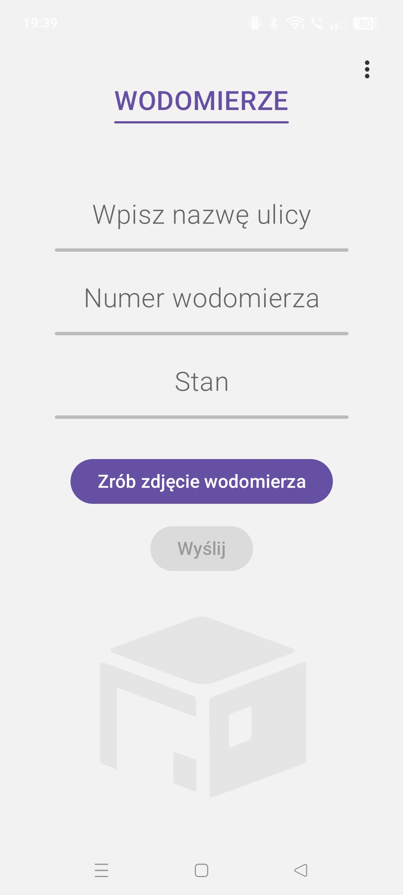

# Zgłoszenia / Gabaryty

Aplikacja mobilna stworzona w Kotlinie (Jetpack Compose),  
przeznaczona do obsługi zgłoszeń w administracji nieruchomości.

Ułatwia pracę w terenie oraz w biurze – pozwala szybko dodawać
i przeglądać zgłoszenia bez używania papierowych formularzy.

## Funkcje
- dodawanie zgłoszeń gabarytów
- obsługa zleceń
- formularze z zapisanym stanem
- czytelny i prosty interfejs
- aplikacja tworzona pod realne potrzeby pracy

## Zrzuty ekranu

### Główne okno – Zgłoszenia

### Okno wodomierzy

### Okno grafiku

